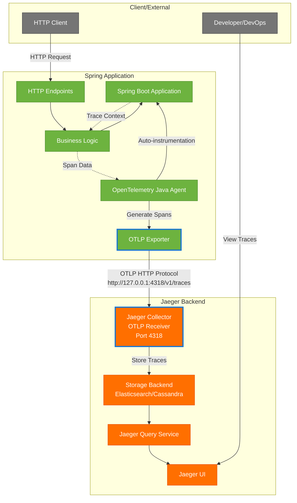
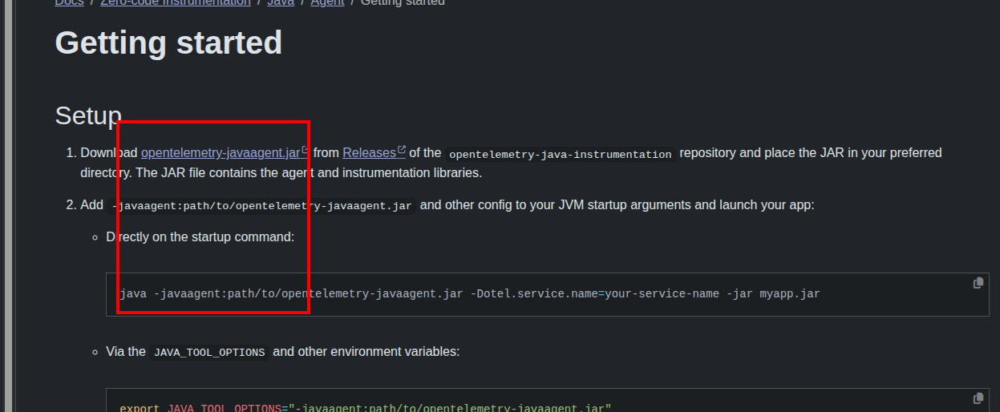
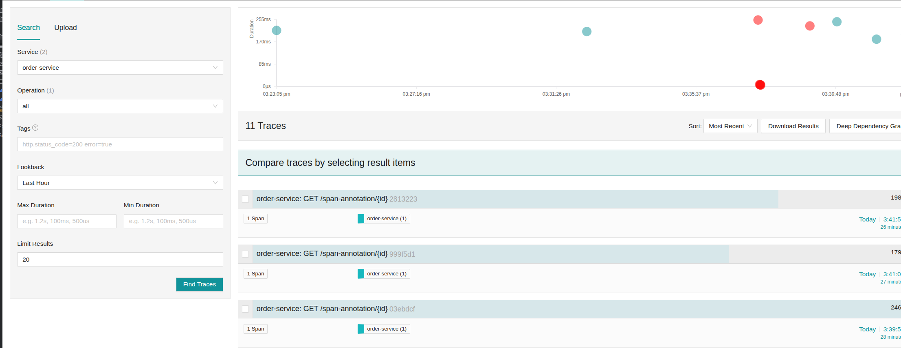

# Otlp + jaeger 收集trace 介紹

## 介紹

OpenTelemetry Java Agent 默认会尝试导出三种类型的遥测数据：
Traces ✅ (Jaeger 支持)
Logs ❌ (Jaeger 不支持)
Metrics ❌ (Jaeger 不支持)




# 下載腳本

* https://opentelemetry.io/docs/zero-code/java/agent/



## 啟動agent + spring boot example

```shell
export OTEL_SERVICE_NAME="order-service"
#
export OTEL_EXPORTER_OTLP_ENDPOINT=http://127.0.0.1:4318/v1/traces
export OTEL_EXPORTER_OTLP_TRACES_ENDPOINT=http://127.0.0.1:4318/v1/traces
export OTEL_LOGS_EXPORTER=otlp
export OTEL_EXPORTER_OTLP_LOGS_ENDPOINT=http://127.0.0.1:4318/v1/logs
export OTEL_RESOURCE_ATTRIBUTES="deployment.environment=production,service.version=2.0.1"
# 启用日志自动收集
export OTEL_INSTRUMENTATION_LOGBACK_APPENDER_EXPERIMENTAL_LOG_ATTRIBUTES=true
export  PATH=PATH:/home/fenrir/.sdkman/candidates/java/21.0.5-amzn/bin
# 禁用 Logs 导出
export OTEL_LOGS_EXPORTER=none

# 禁止使用otel java agent 的metric輸出
export OTEL_METRICS_EXPORTER=none

# 需要metric收集
#export OTEL_EXPORTER_OTLP_METRICS_ENDPOINT=http://127.0.0.1:4318/v1/metrics

java -javaagent:./agent_lib/opentelemetry-javaagent.jar -jar ./build/libs/open-telemetry-java-0.0.1-SNAPSHOT.jar
```

# 開啟 `[jaeger](jaeger)`

執行　[docker-compose.yaml](jaeger/docker-compose.yaml)


## 使用測試請求

*　[jeager-test.http](http-test/jeager-test.http)


## 看看　jeager　ui

 * http://127.0.0.1:16686/search

 * 結果　