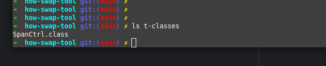
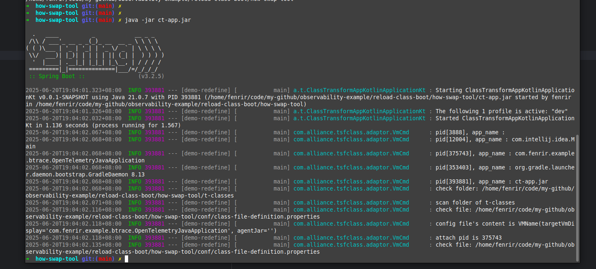
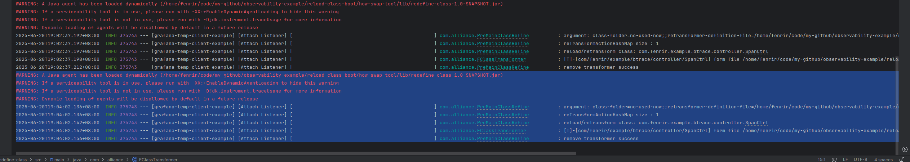

# class re define 工具

把要更新的class放在t-classes folder內



---

配置目標vm, pid or name showed by jps

````shell
 vi conf/vm-name.properties 
````

```properties
# 目標vm, pid or name showed by jps , 可為空
com.alliance.transform.target-vm-display=com.fenrir.example.btrace.OpenTelemetryJavaApplication
```

---

launch ct app

```shell
java -jar ct-app.jar 
```

1. 成功執行



目標class reload成功會有log如下

