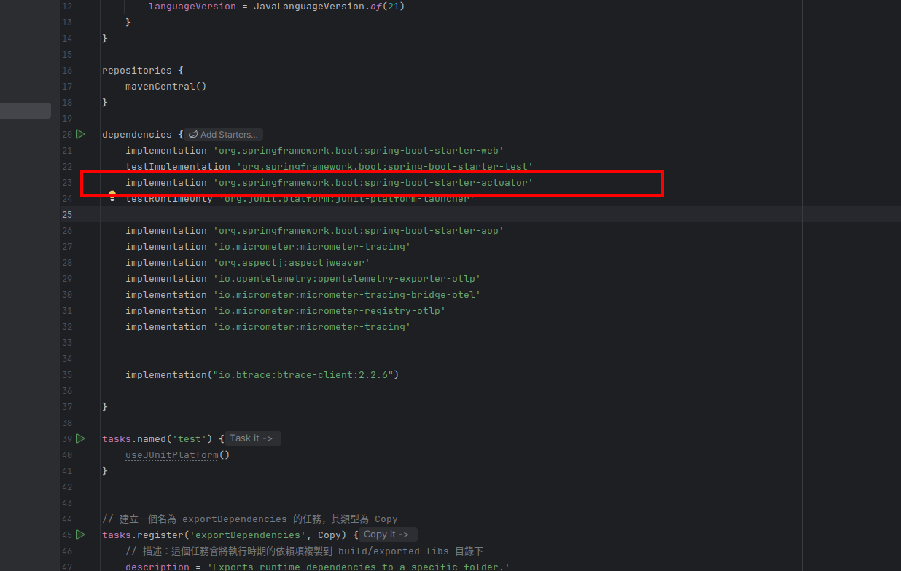
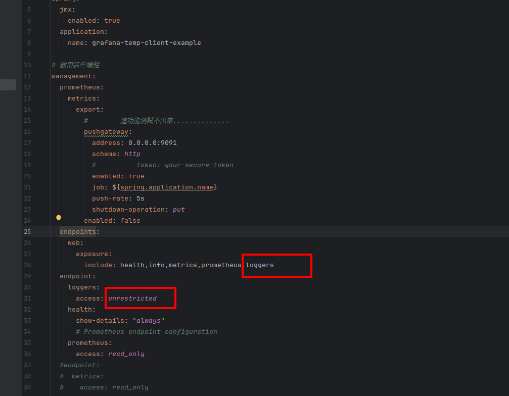
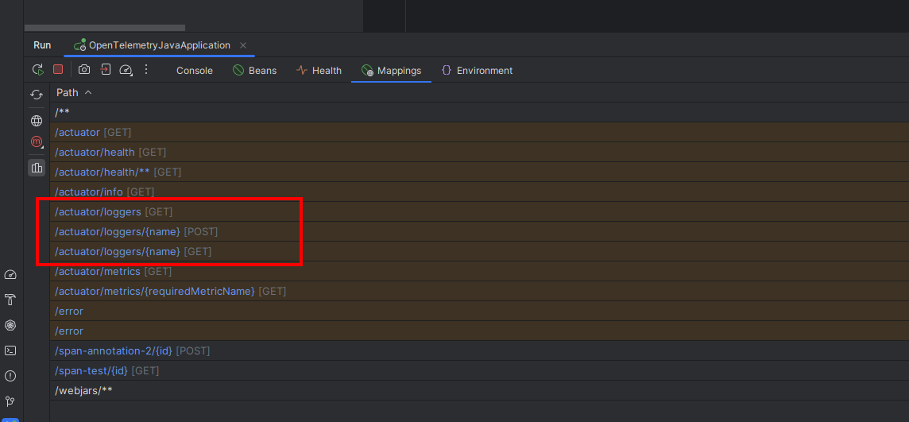
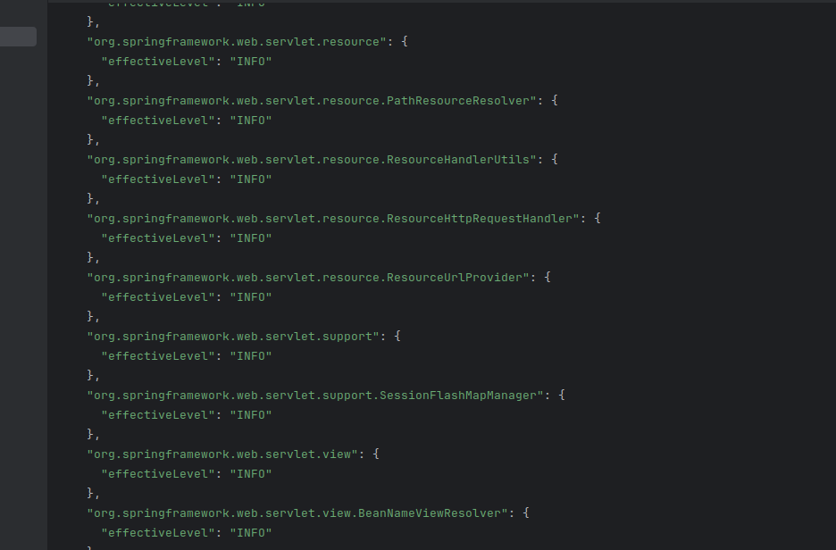
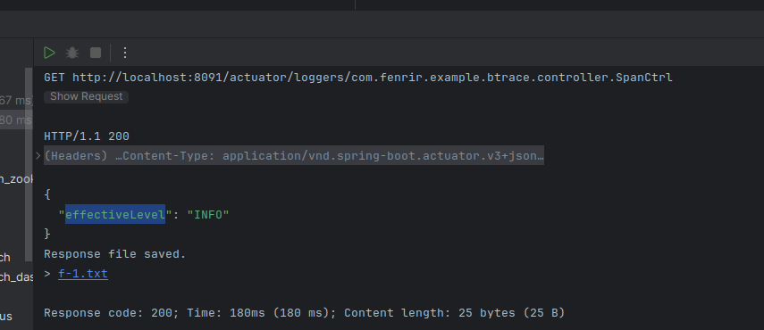
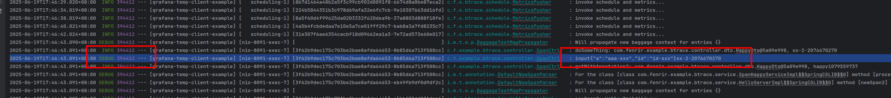

- 引入 `org.springframework.boot:spring-boot-starter-actuato`



- 配置application.yaml



- 啟動服務看到endpoint mapping有這些url



- 調用`http://localhost:8091/actuator/loggers`, 可以看到各個class的LEVEL



- 查找原本的class 的log level 看[logs.http](http-test/logs.http)的
  `GET http://localhost:8091/actuator/loggers/com.fenrir.example.btrace.controller.SpanCtrl`



- 更改log level

```http request
###
POST http://localhost:8091/actuator/loggers/com.fenrir.example.btrace.controller.SpanCtrl
Content-Type: application/vnd.spring-boot.actuator.v3+json

{
  "configuredLevel": "TRACE"
}

```

* https://docs.spring.io/spring-boot/reference/actuator/loggers.html


- 驗證結果, 有效!!

* see [logs.http](http-test/logs.http)


